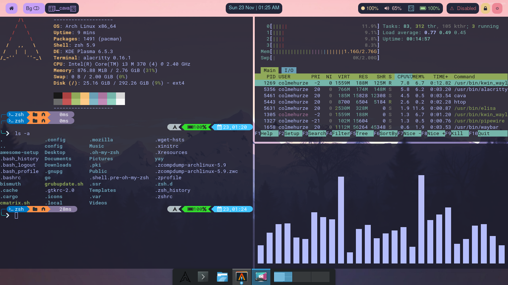

# KDE-plasma-rice
My First Arch Linux KDE Plasma Rice. 

I have attached a detailed guide on how to get this exact rice on your preferred linux distro. Please note that being on an Arch Based distro gives you an advantage as you can use package managers like yay to install dependencies quickly.

## Pre-Requisites ✅:
1. Any Linux Based distribution running KDE plasma version 5 and above, on wayland.
2. Atleast 1gb ram and 15-20gb storage. My rice uses around 800-900MB ram on idle.

## Dependencies 📌:

My rice requires you to install the ``catppuccin-gtk-theme-mocha`` package, and the "Fira Sans Semibold" and "Font awesome" fonts. If you are facing issues, installing nerd-fonts could also be a good idea. 

If you are on Arch Linux, you can install the ``catppuccin-gtk-theme-mocha`` package by using ``yay -S catppuccin-gtk-theme-mocha``. 

## Getting Started 🚀:

1. Install these packages:
   ``alacritty waybar htop cava zsh git rofi fastfetch``

   Note: If you are using arch linux, you can do ``sudo pacman -S --needed base-devel git`` instead to install git and the packages we need to build yay later.

2. Clone my repository using:

   ``git clone https://github.com/colmehurze-tech/kde-plasma-rice.git``

3. Make a backup of your existing config files:

   ``mkdir ~/.config-backup && cp -r ~/.config ~/.config-backup``

4. Copy my config files over to your user config folder:

   ``cd kde-plasma-rice``

   ``cp -r .config/alacritty ~/.config/alacritty``

   ``cp -r .config/waybar ~/.config/waybar``

   ``cp -r .config/rofi ~/.config/rofi``

   ``cp -r .config/cava ~/.config/cava``

5. Open the KDE-plasma system settings app, search for Window Management, click on K-win Scripts. Then click "get new scripts" and search for "Krohnkite". Then Install it. Click the toggle icon to configure Krohnkite. Click the geometry tab, and set the spacing between tiles to 5px. Then close the config window, check Krohnkite, and click Apply. You should have a tiling window management similar to hyprland now.

   Note: If you want you can set a shortcut for the alacritty terminal, via the KDE system settings app. I personally set it to Meta+space, since Meta+Return is used by some Krohnkite process, and I did not want to mess with that.

## Configuring fastfetch, oh-my-zsh, and oh-my-posh ⚡: 

1. You can find the fastfetch config file in ``~/.config/fastfetch/config.jsonc``. You can modify it however you like, but to get the exact same fastfetch as mine, use ``cp -r .config/fastfetch/config.jsonc ~/.config/fastfetch/config.jsonc``. Please note that I'm using zsh shell in my rice, and I have set an alias for fastfetch custom config, to which we will get to in a short while.

   Note: If you cannot find the ``config.jsonc`` file, type ``fastfetch --gen-config`` in your terminal. 

2. Install oh-my-zsh using the instructions on [oh-my-zsh-link](https://ohmyz.sh/). I could have provided an install script, but install scripts and links change over time, so please install it using the official installation script.

3. Install oh-my-posh using the instructions on [oh-my-posh-link](https://ohmyposh.dev/docs/installation/linux).

4. Copy my zsh themes using ``mkdir -p ~/.zsh.d && cp -r .zsh.d/ ~/.zsh.d/``

   Note: I have set zsh to use the atomic theme by default, and there are some other themes included in my rice. Obviously, you are not limited to those and can look up new themes at [zsh-themes-link](https://ohmyposh.dev/docs/themes)
   
5. Install zsh-autosuggestions and zsh-syntax-highlighting using [this link](https://github.com/zsh-users/zsh-autosuggestions/blob/master/INSTALL.md) and [this link](https://github.com/zsh-users/zsh-syntax-highlighting/blob/master/INSTALL.md).

   Note: There are several ways to install these plugins to zsh. I recommend using the "oh-my-zsh" method, as I have set the configuration as such on my ``.zshrc`` file.

6. Copy my ``.zshrc`` file using ``cp -r .zshrc ~/.zshrc``. 

   Note: You can change the colour of the fastfetch logo by editing the line ``alias arch="fastfetch --color yellow --logo-color-1 red --logo-color-2 yellow"``. Set the logo colours to your preffered colours. 

## Configuring the KDE plasma taskbar ⚡:

I have shortened the taskbar, and removed useless stuff from it to give it a clean dock-like look. You are obviously free to design around the taskbar in any way you wish, and I have included the black Arch Linux icon I'm using in my repo, in case you need that. 

You can set waybar to automatically start when KDE plasma starts up, using the system settings app. That way you don't need to explicitly start waybar again and again.

## Final Words ✨: 

Congrats on sucessfully installing my rice! You can look around my config files and tinker around a bit to customize further. I have included the wallpaper I have used in the screenshot as well, so feel free to use it. 

P.S.: If you're wondering what that music bars terminal program thingy I'm using, it's called ``cava``. I have already made you install it :)